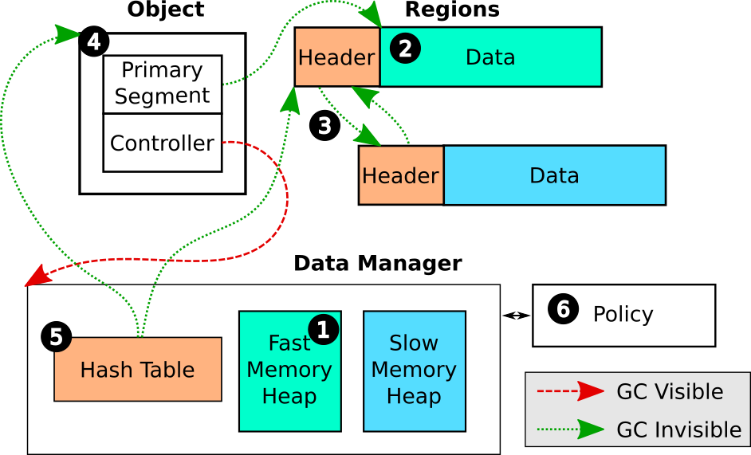
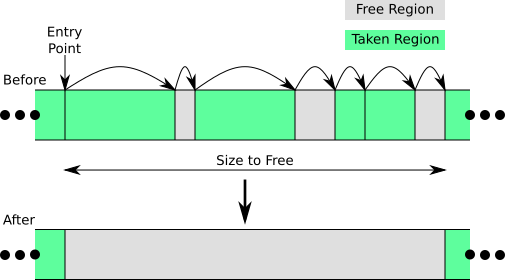
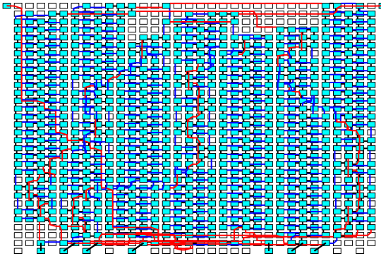
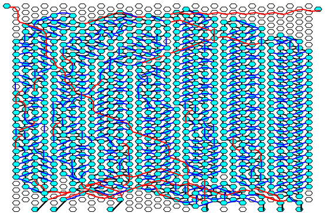
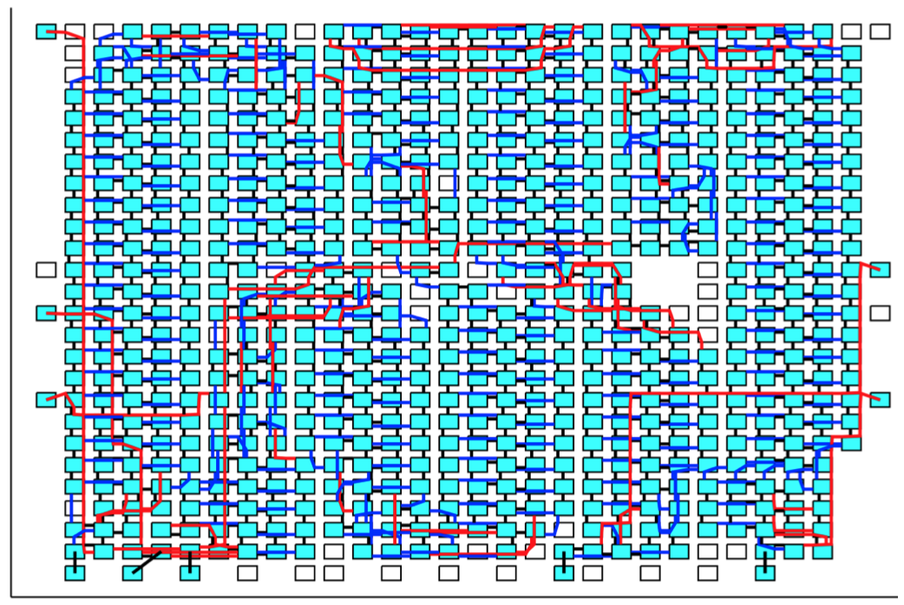
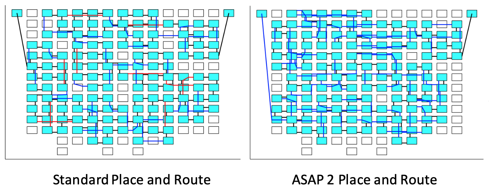

## About

* My name is Mark.
* I've just finished up my PhD work at [UC Davis](https://arch.cs.ucdavis.edu) in Computer Engineering/Architecture.
* I program a lot and thus have a [GitHub](https://github.com/hildebrandmw).

I like solving problems.
I am most excited when I don't initially know what the solution is going to look like because that provides the most opportunity for learning new things.

# Projects

Here's a list of programming projects that I have worked on, either as part of my graduate research, during internships, or for other extracurricular purposes.
I've attached approximate dates associated with each project.
These dates mainly correspond to the time when the projects were under active development.
Many of these projects continued to be used to run experiments and received minor improvements and bug fixes.

**Table of Contents**

*Intel Internship Projects*
* [Similariy Search](#billion-scale-approximate-similarity-search) -- [September 2020 - March 2022, 10% time from March 2021 to March 2022]

*Research Related Projects*: Most of the technical work for my PhD was completed by late 2021.
After that, it was mostly a matter of minor bug fixes and running experiments for my dissertation.

* [AutoTM](#autotm) -- [February 2019 - December 2019]
* [OneDNN.jl](#onednn-wrapper-for-julia) -- [June 2020, April 2021 - November 2021]
* [CachedArrays.jl](#cachedarrays) -- [April 2020 - June 2020, April 2021 - October 2021]
* [CounterTools.jl](#countertools) -- [November 2019, March 2020]
* [SystemSnoop.jl](#systemsnoop) -- [October 2018 - February 2019]

*Miscellaneous Projects*
* [Many-Core Place-and-Route](#many-core-place-and-route) [October 2017 - September 2018]
* [DE10 Lite HDL](#de10-lite-hdl) [on-and-off August and September 2018]

----------

## Internship Projects (Intel)

### Billion Scale Approximate Similarity Search

**Dates:** Approximately December 2020 or so (I was initially working on other related projects) to March 2021 full time on this project, then from April 2021 to March 2022 at 10% time.

This was work that I conducted while interning at Intel.
Although I can't link to any of the written code, I can provide some links to articles written by my awesome collaborators:

* [The Parallel Universe (Issue 48)](https://www.intel.com/content/www/us/en/developer/community/parallel-universe-magazine/overview.html)
* [Intel Labs Linkedin](https://www.linkedin.com/pulse/power-intel-hardware-billion-scale-similarity-search-mariano-tepper/)

In a nut-shell, the name of the game is:

* Given a query vector `q ∈ ℜⁿ`, distance function `f`, and comparison function `lt`, find the `k` nearest neighbors in some dataset `D` (whose elements, believe it or not, are also in ℜⁿ ... usually) with respect to `f` and `lt`.

The approximate part comes from relaxing the restriction that the `k` nearest neighbors are the *exact* nearest neighbors.
In other words, we're willing to trade exactness for performance (to a point, we could always return `k` random neighbors for a really fast algorithm, but that wouldn't be particularly useful).

**Role:** I was the primary developer behind this submission (writing code, debugging, performance optimization).
Highlights of the library include:

* Distance computation functions (e.g. Euclidean and Inner Product) optimized to use AVX instructions for both long vectors (think 100+ dimensional) and short vectors (like 4 dimensions like you would find for product quantization).
* Flexible type promotion in distance function computation allowing for comparison between mixed types including Float16.
* Well defined graph adjacency list API to allow for flexibility in the graph representation (helpful for storing the graph on Optane).
* Dynamic multi-threaded load balancing of work for both querying and index construction.
* NUMA aware data structures allowing for near-perfect scaling on multi-socket systems.

----------

## Research Related Projects (UC Davis)

### AutoTM

* [AutoTM - Github](https://github.com/darchr/AutoTM)
* [AutoTM - Publication](https://arch.cs.ucdavis.edu/machine%20learning/memory/2019/12/15/autotm.html)

**Dates:** We first had the idea for this around February 2019.
I was able to write the code and generate results for the submission in late August of 2019.
After that, I spent a couple months cleaning up the code for artifact submission and working on some improvements for other research.

**Role:** I worked with my advisors on the high level ideas behind this project and on designing what kind of experiments we wanted to run and which data to collect.
Other than that, I wrote all of the code and performed all of the experiments.

**Description:** This is the project for my 2020 [ASPLOS](https://asplos-conference.org) paper.
At a high level, the goal of this project was given:

1. A static computation graph for a convolutional neural network.
2. Two memories, one fast and one slow with a size constraint on the fast memory.

To minimize graph execution time by controlling the placement and movement of intermediate data (tensors) in the fast and slow memories.
The technique to achieve this was to first profile all kernels in the execution graph for their runtime performance for all possible memory locations of input and output parameters.
Then, using this information and the computation graph, express the optimization problem as an Integer Linear Program (ILP) and offload all the thinking to [Gurobi](https://www.gurobi.com).

In detail, this project involved:
* Writing a Julia front-end for the [*nGraph*](https://github.com/NervanaSystems/ngraph) compiler (which has since become [OpenVino](https://github.com/openvinotoolkit/openvino)) allowing for both models to be constructed via Julia as well as exposing enough of the *nGraph* internal state to extract the computation graph.
  A very work-in-progress, just-for-fun partial rewrite of this front-end for the new OpenVINO framework can be found [here](https://github.com/hildebrandmw/OpenVINO.jl).
* Modify the *nGraph* compiler to use two memory pools, one for DRAM and one for Optane.
  In addition, this required introducing a new "Move" node to move tensors between pools and modifying the node scheduler to put "Move" nodes in the correct spot.
* With access to this internal state, write code to profile the kernels and cache all the timing results.
  For the GPU, this also involved profiling different algorithm implementations.
* Use all this information and Julia's **excellent** mathematical modeling framework [JuMP.jl](https://github.com/jump-dev/JuMP.jl) to construct and solve the ILP formulation.
* Round-trip the solution of the ILP problem back into the *nGraph* compiler and finish compiling the program.
* Profit!

This involved messing around with the internals of *nGraph*, which was quite fun.

----------

### OneDNN Wrapper for Julia

* [OneDNN.jl - Github](https://github.com/hildebrandmw/OneDNN.jl)

**Dates:** I had the original idea in June 2020. Work done on-and-off from April 2021 to November 2021 to turn it into a functioning project.

**Description:** For my PhD work on heterogeneous memory, I needed high-performance neural network primitives where **I** controlled the pointers for the intermediate tensors.
The solution was to create a Julia wrapper for Intel's [OneDNN](https://github.com/oneapi-src/oneDNN) library, which basically supplies the fastest CPU-based neural network primitives around.

This wrapper library features a bunch of cool things:
* Automatic glue-code generation of the OneDNN C header using [Clang.jl](https://github.com/JuliaInterop/Clang.jl) (along with some expression rewriting to use the type system to catch some pointer conversion bugs).
* Support for giving memory to OneDNN through arbitrary Julia arrays (including transposes and array views).
* A parser/converter for OneDNN's exotic blocked memory layouts.
* Support for full forward and backward passes of neural networks using [ChainRules.jl](https://github.com/JuliaDiff/ChainRules.jl).
  In particular, the defined rules could fuse activations for convolutions and dense layers if the OneDNN library allowed it.

----------

### CachedArrays
* [CachedArrays.jl - Github](https://github.com/darchr/CachedArrays.jl)

**Dates:** The initial work on this project was done from April 2020 to June 2020 as a follow-on to AutoTM.
I did an internship at Intel and came back to this project between about April 2021 and October 2021.

**Description:** In many respects, this is a generalization of the ideas presented in [AutoTM](#autotm).
The idea is to introduce an array type in Julia that can both live and migrate between fast and slow memory, but isn't limited to static computation graphs like AutoTM was.

A general overview of the architecture of CachedArrays is shown in the figure above.
The manager maintains two memory heaps: one for fast memory and one for slow.
Data arrays that are allocated are backed by an "object", which contains a pointer to the actual data backing the array.
The actual data live in either fast or slow memory and can migrate between memory pools during runtime.
The policy component is customizable on a per-application basis and can take semantic hints from the user to help direct data orchestration.

In order to support migrating data from one memory pool to the other, the memory heaps in CachedArrys need to support eviction.
Because memory allocations are not uniform in size, this potentially requires evicting multiple memory blocks at a time.
The figure above shows what this looks like.
Beginning at some entry point, the heap manager calls a call-back function on each allocated block it experiences.
This callback is responsible for migrating the existing data to the remote memory pool.
Free regions are skipped over.
Once enough memory has been freed, a new larger allocation can be conducted.

More information on CachedArrays as well as its usage in CNN experiments can be found in Chapter 4 of my dissertation [link coming].

----------

### CounterTools

* [CounterTools.jl - Github](https://github.com/hildebrandmw/CounterTools.jl)

**Dates:** Some initial exploration in November 2019.
The majority of this tool was developed in March 2020 when I finally decided that I really needed it.

**Description:** A small library I wrote for configuring and reading both core and uncore hardware performance counters on x86 Intel CPUs.
This mainly works on Skylake/Cascade Lake server CPUs with some support for the Ice Lake IMC (integrated memory controller) counters.

Now, you're probably asking yourself: "why do we need yet another performance counter library when things like `perf` and [pcm](https://github.com/opcm/pcm) exist?"
The answer is: "Well, we really don't."

My motivation for writing this was:
* I needed low-overhead (`pcm` uses this giant centralized class that isn't exactly lightweight) where I knew exactly what was being configured (I was afraid of `perf` trying to be fancy and do something like time multiplexing counters without me knowing).
* I wanted to learn more about performance counter architecture and configuration.

This library worked really well for me, but I completely do not recommend it in favor of more industrial strength tools. 😛

----------

### SystemSnoop

* [SystemSnoop.jl - Github](https://github.com/hildebrandmw/SystemSnoop.jl)

**Dates:** Mostly developed between October 2018 to February 2019.
This originally contained a **lot** more functionality, including [reuse distance](https://www.cs.rochester.edu/~cding/Documents/Publications/TR741.pdf) for Linux applications using [idle page tracking](https://www.kernel.org/doc/html/latest/admin-guide/mm/idle_page_tracking.html).
However, it was simplified to the more minimal tool it is now when I was working on AutoTM.

**Description:**SystemSnoop is one of those tiny utility packages that just end up being super useful.
Though-out my PhD work, I did a lot of performance monitoring such as periodically collecting memory consumption of running applications, reading performance counters, taking time stamps, etc.
This package helped automate that process using a simple measurement API:

* `prepare(x)`: Prepare some instrument `x` (optional).
* `measure(x)`: Perform a measurement on `x` (required).
* `cleanup(x)`: Perform any tear-down required for instrument `x` (optional).

Multiple instruments are collected into a `NamedTuple` which automatically broadcasts the API functions along each element of the tuple and constructs a `NamedTuple` of measurements.
Though this is simple, it provided a uniform and reliable way of grouping together my desired measurements, collecting the results, and easily allowed for new measurement types to be added.

----------

## Miscellaneous Projects

### Many-Core Place-and-Route

* [Mapper2](https://github.com/hildebrandmw/Mapper2.jl): The core code behind the place-and-route tool.
* [AsapMapper](https://github.com/hildebrandmw/AsapMapper.jl): Code specific to Kilocore (and the other AsAP models).

**Dates:** Work started on this tool in earnest in October 2017 (after a few previous no-so-great attempts) and continued until around September 2018.
I was doing an internship in San Jose between July 2018 and late August 2018, so not much work was done on this project during that time.

**Description:** This was the first real project I worked on when I started graduate school at UC Davis at the [VLSI Computation Lab](http://vcl.ece.ucdavis.edu).
The "Mapper" is a research place-and-route tool for applications written targeting [Kilocore](http://vcl.ece.ucdavis.edu/pubs/2017.03.Micro.kilocore/).
While it was originally meant to just automate the process of assigning tasks to cores for better simulation results (plus, no one wants to do this by hand for 1000+ tasks), I realized this could be a much more general tool to allow for design space exploration, both in network topology as well in place-and-route algorithms.

Here's a link to a published paper where Figure 3 was placed by my tool: [PDF Warning](http://vcl.ece.ucdavis.edu/pubs/2021.05.TCASII.DSC/2021.05.TCASII.Wu.pdf)

This final tool works on arbitrary grids (i.e., rectilinear, hexagonal) as well as irregular grids (arbitrary processors can be removed and the tool will place around that).
The two figures below show the same application (I think it's some kind of FFT application) mapped to two different topologies.
In these figures, squares represent processors (or memory tiles like on the bottom), cyan represents a task mapped to a tile, and the lines (black, blue, or red) indicate communication links between tiles.

**Figure: Rectilinear Topology with memory along the bottom.**

**Figure: Hexagonal Topology with memory along the bottom.**

**Figure: Routing around a missing block of processors.**

Additionally, the tool allows for extension of the placement objective.
For example, the figure below shows two different placement strategies for the older AsAP 2 architecture, one where the total number of hops is minimized (left) and one where the maximum hop length is minimized (right).
Though the placement on the left has fewer total hops, the one on the right is *faster* because the maximum hop between two communicating processors is 2 (AsAP 2 had a quirk where link frequency decreased with hop count).
The tool could support all kinds of flexible tweaks like this.
Plus, it was very fast.

**Figure: Tailoring placement objective to minimize the maximum link length. Left: 237 hops with a maximum length of 3. Right: 262 hops with a maximum length of 2.**

----------

### DE10-Lite HDL

* [DE10-Lite - Github](https://github.com/hildebrandmw/de10lite-hdl)

**Dates:** A few days here and there during August and September 2018.

**Description:** I worked as a teaching assistant (TA) for the UC Davis "intro to Verilog-based digital design" class for many quarters (like 5 or 6? I don't remember).
Over time, I was tasked with creating the lab exercises the students did every week.
Now, this class used the [DE10 Lite](https://www.terasic.com.tw/cgi-bin/page/archive.pl?Language=English&No=1021) from Terasic with an Intel [Max 10 FPGA](https://www.intel.com/content/www/us/en/products/details/fpga/max/10.html) and includes all these fun peripherals like SDRAM, an accelerometer, VGA port etc.
However, we basically never used them in the class because:
1. None of the TAs had bothered getting them to work and the reference code was scary to say the least.
2. This was an *intro* class so we could only get so complicated with the labs we created.

To that end, I spent some time getting all the peripherals working with (hopefully) clean, simple interfaces that students could actually use and (again hopefully) clear enough Verilog to serve as an example for student's designs.
Features of this library include:

* Exposing the SDRAM to students' designs.
* Simple interface for the accelerometer.
* Simple interface for the VGA port.
* Data transfer from host computer to the FPGA over the USB programming cable.

Nothing too fancy, but I did get it to the point where I could transfer a "gif" from my computer to the FPGA and have it be displayed on a screen through the board's VGA cable, so that was fun.
I hope future TAs of the class found it useful.
